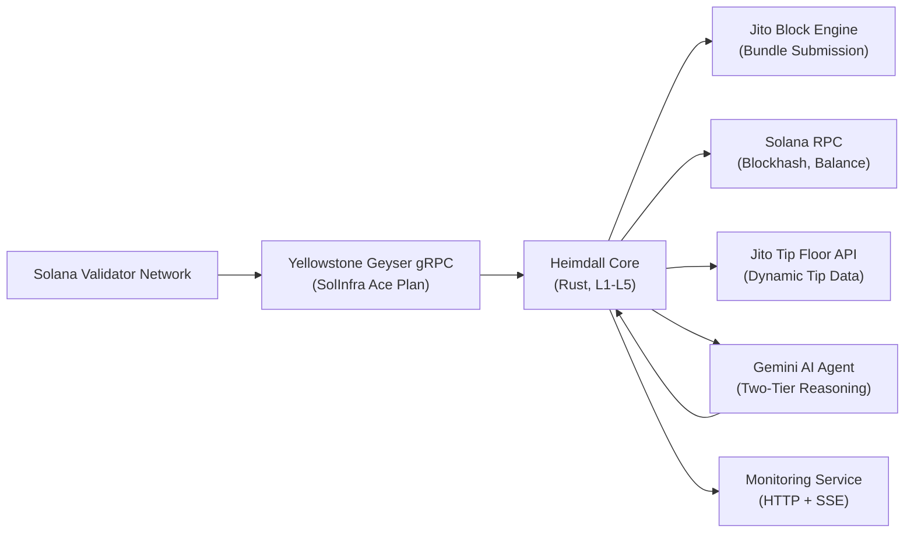
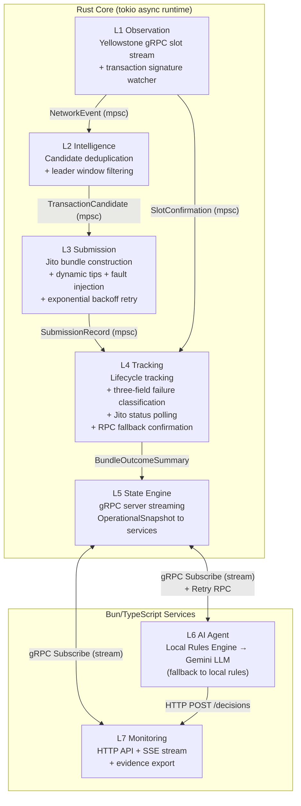
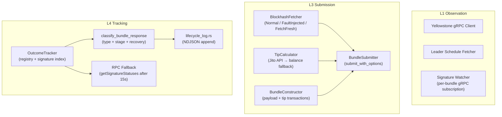
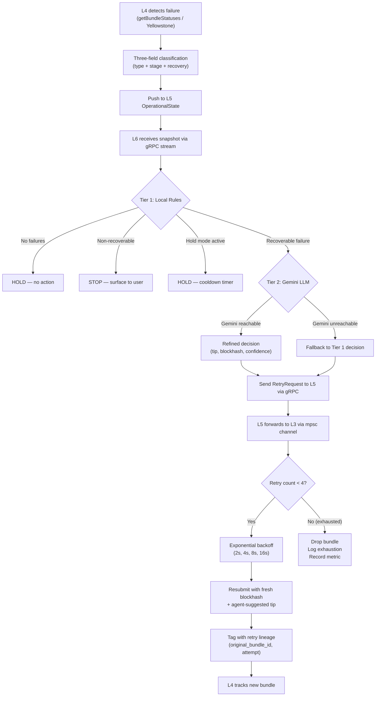

# Heimdall Architecture

Heimdall is a seven-layer Solana transaction infrastructure stack split across a Rust core and Bun/TypeScript services.

## System Context



## Container View



## Component Diagram — Rust Core



## Data Flow

1. **L1** subscribes to Yellowstone slot updates and leader schedule data via SolInfra's Ace plan gRPC endpoint.
2. **L1** spawns per-bundle Yellowstone transaction signature watchers after each submission for sub-second confirmation.
3. **L2** deduplicates processed slot events and produces transaction candidates with leader identity.
4. **L3** constructs Jito bundles (payload + tip transaction), calculates dynamic tips from the Jito tip floor API, and submits the bundle.
5. **L3** handles retry requests from L6 with exponential backoff (2s, 4s, 8s, 16s) up to 4 attempts, fetching a fresh blockhash on retry.
6. **L4** tracks bundle lifecycle via three confirmation paths: (a) Yellowstone per-bundle signature watchers, (b) Jito `getBundleStatuses` polling, (c) RPC `getSignatureStatuses` fallback after 15s timeout. Applies three-field failure classification.
7. **L5** snapshots the current `OperationalState` every 500ms and streams it to L6/L7 via gRPC server-side streaming.
8. **L6** runs a two-tier reasoning pipeline: deterministic local rules produce an initial decision, then Gemini LLM refines it. Falls back to local rules if Gemini is unreachable. Sends `RetryRequest` back to L5 via unary gRPC RPC.
9. **L7** consumes the same snapshot stream for HTTP API endpoints, SSE real-time streaming, and on-demand evidence report generation.

## Channel Topology

| Channel | From | To | Message Type | Buffer |
|---|---|---|---|---|
| `event_tx/rx` | L1 | L2 | `NetworkEvent` (SlotUpdate, LeaderWindow) | 1000 |
| `candidate_tx/rx` | L2 | L3 | `TransactionCandidate` | 100 |
| `submission_tx/rx` | L3 | L4 | `SubmissionRecord` | 100 |
| `confirmation_tx/rx` | L1 | L4 | `SlotConfirmation` (slot + optional signature) | 1000 |
| `tip_tx/rx` | L3 | L5 | `TipUpdate` | 100 |
| `retry_tx/rx` | L5 | L3 | `RetryRequest` (from gRPC Retry RPC) | 32 |

## Failure Handling Strategy

### Three-Field Classification

Every failure is decomposed into three fields:

| Field | Purpose | Examples |
|---|---|---|
| `failure_reason` | Machine-readable category | `expired_blockhash`, `fee_too_low`, `bundle_failure`, `compute_exceeded`, `unknown` |
| `failure_stage` | Pipeline stage where failure occurred | `pre_submission`, `submission`, `execution`, `confirmation`, `yellowstone_stream` |
| `recovery` | Human-readable recovery guidance | "Fetch a fresh blockhash via getLatestBlockhash at confirmed commitment and resubmit." |

### Recovery Strategies

| Failure | Detection | Recovery |
|---|---|---|
| `expired_blockhash` | `getBundleStatuses` returns empty + zeroed blockhash, or Jito response contains "expired" | L6 requests retry with `refresh_blockhash=true`; L3 calls `fetch_fresh()` bypassing fault injection |
| `fee_too_low` | Jito response contains "fee" + "low" | L6 suggests higher tip; L3 resubmits with tip override |
| `compute_exceeded` | Jito response contains "compute" + "exceeded" | L6 can suggest retry if network load decreased |
| `bundle_failure` | Jito response contains "rejected", "invalid", "failed" | L6 evaluates whether retry is worthwhile |
| Yellowstone disconnect | gRPC stream error or None | L1 reconnects with exponential backoff (1s→30s) and refetches leader schedule |
| Channel backpressure | `try_send` returns full error | L1 drops the event and logs a warning; stream consumer is never blocked |

### Retry Strategy

| Parameter | Value |
|---|---|
| Max attempts | 4 |
| Backoff base | 2 seconds |
| Backoff schedule | 2s → 4s → 8s → 16s |
| Blockhash on retry | Always fresh (bypasses fault injection) |
| Tip on retry | Suggested by L6 agent (clamped to 1k–100k lamports) |
| After max attempts | Bundle dropped, failure logged |

## AI Agent Responsibilities

L6 owns all retry decisions through a two-tier reasoning pipeline:

### Tier 1 — Local Rules Engine (deterministic, always runs)
- Computes landed rate, failure type distribution, slot gap
- Produces a decision with confidence score (0.0–1.0) and risk assessment
- Short-circuits on "no failures" (confidence: 1.0)
- Detects non-recoverable failures (compute_exceeded, program_error, account_not_found) and stops retrying
- Tracks consecutive retry failures and enters hold mode after 3

### Tier 2 — Gemini LLM (runs when Tier 1 recommends retry)
- Receives the operational snapshot AND the local decision as context
- Reasons independently against hard constraints (tip floor, budget cap)
- May override the local decision's tip or action
- Returns structured JSON with confidence and risk assessment

### Fallback
- If Gemini API is unreachable (network error, rate limit, model error), the Tier 1 local rules decision is used
- Decision is marked `source: "fallback"` for auditability

The agent does not construct bundles or touch blockchain state directly. Those responsibilities stay in the Rust core.

## Retry Control Loop



## Failure Escalation

| Condition | Action | Duration |
|---|---|---|
| 3+ consecutive retry failures | Enter HOLD mode | 60 seconds |
| Non-recoverable failure (compute, program, account) | STOP retrying | Permanent until manual intervention |
| Landed rate < 30% across 5+ runs | Hold new submissions | Until next successful snapshot |
| All 4 retry attempts exhausted | Drop bundle, log to metrics | N/A |

## Retry Lineage Tracking

Every retry submission is tagged with:
- `original_bundle_id`: The bundle ID of the first submission attempt
- `retry_attempt`: Monotonically increasing attempt counter (1, 2, 3, 4)

This lineage is tracked through:
1. `SubmissionRecord` (L3 → L4 channel)
2. `BundleOutcome` (L4 internal state)
3. `LifecycleEntry` (NDJSON log)
4. `BundleOutcomeSummary` (gRPC snapshot → L6/L7)
5. Evidence report (downloadable from GET /evidence)

## CLI Tool

Heimdall includes a command-line interface for operational control:

```bash
bun run cli/heimdall.ts <command>
```

| Command | Description |
|---|---|
| `monitor` | Live TUI dashboard with slot pulse, bundle table, AI decisions, retry status |
| `status` | Print current system health and metrics |
| `evidence` | Download judge-ready Markdown evidence report |
| `health` | Check health of all services |
| `start` | Launch all three services |

## Infrastructure Decisions

| Decision | Rationale |
|---|---|
| Rust for L1–L5 | Network-facing hot path needs deterministic state handling and low overhead |
| Bun/TypeScript for L6–L7 | AI and monitoring layers benefit from rapid iteration and JSON/gRPC integration |
| gRPC control plane | Typed, streaming, language-agnostic communication between Rust and TypeScript |
| `tokio::mpsc` channels | Decoupled Rust layers without network hops; non-blocking `try_send` prevents backpressure |
| Isolated L3 submission | Retry behavior, tip logic, and serialization remain testable and independent |
| NDJSON lifecycle log | Append-only format auditable after execution; structured for programmatic parsing |
| Yellowstone for both slots and signatures | Single provider (SolInfra) for all streaming data; dedicated per-bundle signature watchers |
| Exponential backoff | Industry-standard retry pattern preventing thundering herd on transient failures |
| Two-tier AI pipeline | Deterministic rules catch obvious cases; LLM handles nuanced reasoning; fallback ensures availability |
| Retry lineage | Full chain of custody from original → retry enables root cause analysis |

## Verification Guide for Judges

### How to verify a bundle on Jito
1. Copy a `bundle_id` from `core/final_lifecycle.log` or the `/outcomes` endpoint
2. Visit [Jito Explorer](https://explorer.jito.wtf/) and search for the bundle ID
3. Verify the slot, tip, and status match the lifecycle log entry

### What logs to inspect
- `core/lifecycle.log` — live NDJSON entries as bundles are tracked
- `core/final_lifecycle.log` — curated evidence from a complete run
- Agent console output — shows two-tier decision pipeline in real time
- GET `/evidence` — downloadable Markdown report with tables and statistics

### What to look for in retries
- Entries with `retry_attempt > 0` in the lifecycle log
- `original_bundle_id` linking back to the first submission
- Exponential backoff timing in the agent console logs
- Hold mode activation when consecutive retries fail

### Running the smoke test
```bash
# Start all services first, then:
bash scripts/smoke-test.sh
```

## Notes For Publication

This file is the repo-local draft. For the bounty submission, publish it as a public Notion page, Google Doc, Figma board, or another public URL and link that URL from the README.
