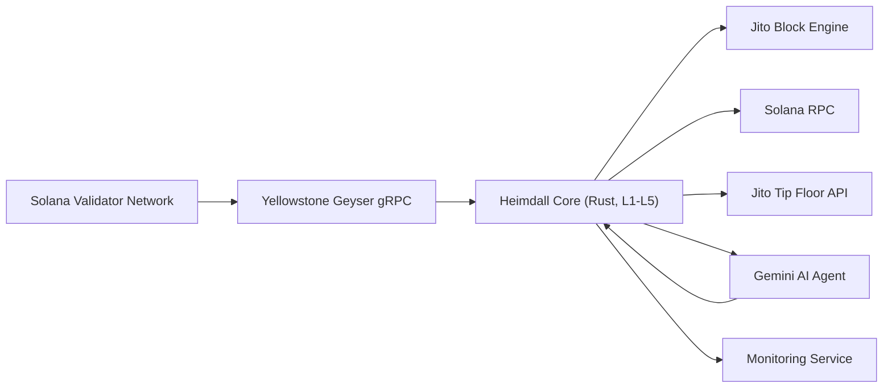
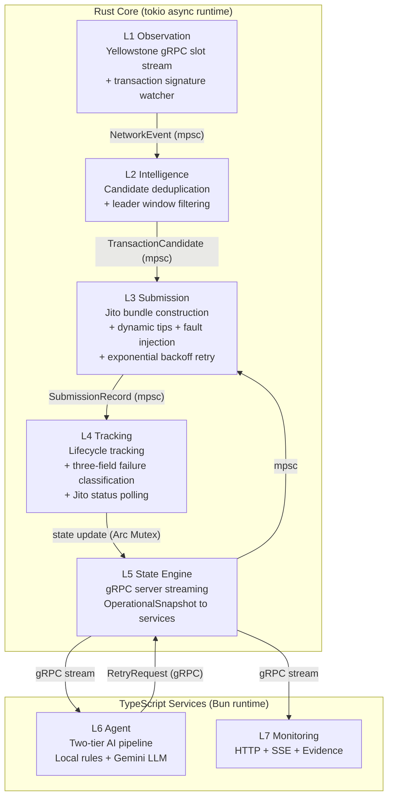

# System Architecture

Heimdall is a seven-layer transaction infrastructure stack split across a Rust core and Bun/TypeScript services.

## System Context

## Container View

## Layer Responsibilities

| Layer | Name | Runtime | Responsibility |
|---|---|---|---|
| L1 | Observation | Rust | Yellowstone gRPC slot stream, transaction signature watchers, RPC fallback |
| L2 | Intelligence | Rust | Candidate deduplication, leader window filtering, slot-to-candidate pipeline |
| L3 | Submission | Rust | Jito bundle construction, dynamic tip calculation, retry execution with backoff |
| L4 | Tracking | Rust | Bundle lifecycle tracking, three-field failure classification, Jito status polling |
| L5 | State Engine | Rust | Operational state aggregation, gRPC server (Subscribe + Retry + Health RPCs) |
| L6 | Agent | TypeScript | Two-tier AI pipeline (local rules + Gemini), failure escalation, hold mode |
| L7 | Monitoring | TypeScript | HTTP API (7 endpoints), SSE streaming, evidence report generation |

## Infrastructure Decisions

| Decision | Rationale |
|---|---|
| Rust for L1–L5 | Network-facing hot path needs deterministic state handling and low overhead |
| Bun/TypeScript for L6–L7 | AI and monitoring layers benefit from rapid iteration and JSON/gRPC integration |
| gRPC control plane | Typed, streaming, language-agnostic communication between Rust and TypeScript |
| `tokio::mpsc` channels | Decoupled Rust layers without network hops; non-blocking communication |
| NDJSON lifecycle log | Append-only format auditable after execution; structured for programmatic parsing |
| Exponential backoff | Industry-standard retry pattern preventing thundering herd on transient failures |
| Two-tier AI pipeline | Deterministic rules catch obvious cases; LLM handles nuanced reasoning; fallback ensures availability |
| Retry lineage | Full chain of custody from original → retry enables root cause analysis |
