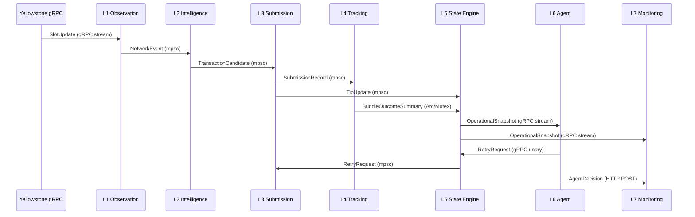

# Data Flow & Channel Topology

## Event Flow



## Channel Types

| Channel | From | To | Type | Buffer |
|---|---|---|---|---|
| NetworkEvent | L1 | L2 | `tokio::mpsc` | 1000 |
| TransactionCandidate | L2 | L3 | `tokio::mpsc` | 100 |
| SubmissionRecord | L3 | L4 | `tokio::mpsc` | 100 |
| SlotConfirmation | L1 | L4 | `tokio::mpsc` | 1000 |
| TipUpdate | L3 | L5 | `tokio::mpsc` | 100 |
| RetryRequest | L5 | L3 | `tokio::mpsc` | 32 |
| OperationalState | L4 → L5 | shared | `Arc<Mutex>` | N/A |

## Bundle Lifecycle

Each bundle progresses through commitment stages:

```
Submitted → Processed → Confirmed → Finalized
     ↓                                   ↑
   Failed ← (failure detected) ──────── OR
     ↓
   Retry (up to 4x with exponential backoff)
     ↓
   Hold Mode (if 3+ consecutive failures)
```

### Commitment Stage Tracking

For each bundle, L4 records:
- **Timestamps**: `submitted_at`, `processed_at`, `confirmed_at`, `finalized_at`
- **Slot numbers**: `processed_slot`, `confirmed_slot`, `finalized_slot`
- **Latency deltas**: `latency_processed_secs`, `latency_confirmed_secs`, `latency_finalized_secs`
- **Confirmation source**: Which mechanism first confirmed the bundle (Yellowstone signature watcher, Jito status polling, slot heuristic, or RPC fallback)

### Retry Lineage

When a bundle is retried, the new submission carries:
- `original_bundle_id`: Points back to the first submission
- `retry_attempt`: Monotonically increasing counter (1, 2, 3, 4)

This lineage flows through all layers: L3 → L4 → L5 → L6 → L7 → evidence report.
