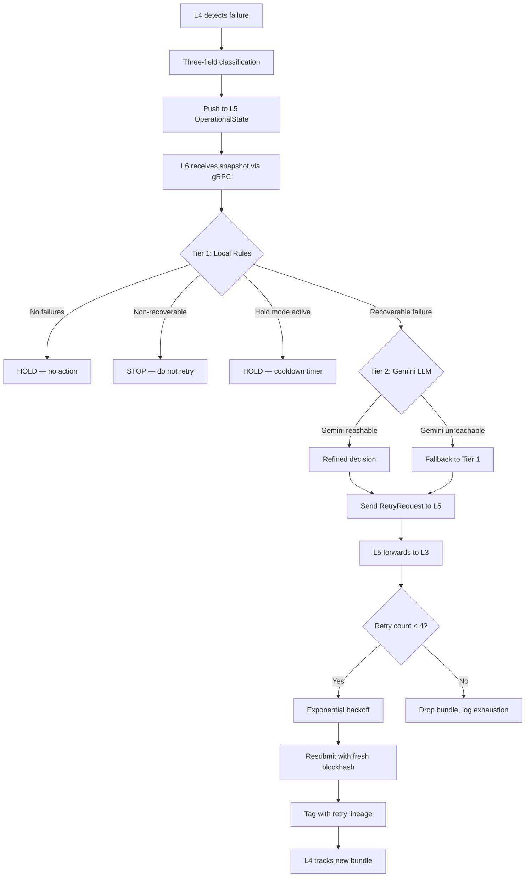

# Retry Control Loop & Failure Escalation

## Decision Flow

## Escalation Rules

| Condition | Action | Duration |
|---|---|---|
| 3+ consecutive retry failures | Enter HOLD mode | 60 seconds |
| Non-recoverable failure (`compute_exceeded`, `program_error`, `account_not_found`) | STOP retrying | Permanent |
| Landed rate < 30% across 5+ runs | Hold new submissions | Until network improves |
| All 4 retry attempts exhausted | Drop bundle, log to metrics | N/A |

## Two-Tier AI Pipeline

### Tier 1 — Local Rules Engine (always runs)

The local rules engine evaluates the operational snapshot deterministically:

1. **No failures** → Hold, confidence 1.0
2. **Non-recoverable failure** → Stop, confidence 0.95
3. **Hold mode active** → Continue holding, confidence 1.0
4. **3+ failed retries** → Enter hold mode, confidence 0.9
5. **Expired blockhash** → Retry with fresh blockhash + 30% tip premium
6. **Fee too low** → Retry with 50% tip premium
7. **Low landed rate** → Hold or retry with congestion premium
8. **Default** → Retry with fresh blockhash

### Tier 2 — Gemini LLM (when Tier 1 recommends retry)

The Gemini model receives:
- Full operational snapshot (slot, tip, active bundles)
- Retry metrics (total retries, succeeded, exhausted)
- Failed bundle details (with retry lineage)
- The Tier 1 decision (for refinement)

Hard constraints enforced on LLM output:
- Tip floor: max(tip_median, 1000) lamports
- Tip ceiling: 100,000 lamports
- Expired blockhash → must set `refreshBlockhash: true`
- Non-recoverable → must not retry

### Fallback

If Gemini is unreachable (network error, rate limit), the Tier 1 decision is used automatically. The decision is marked `source: "fallback"` for auditability.

## Retry Metrics

The system tracks three retry counters:

| Metric | Description |
|---|---|
| `total_retries` | Total retry attempts across all bundles |
| `retries_succeeded` | Retries that were accepted by L3 |
| `retries_exhausted` | Bundles that exhausted all 4 retry attempts |

These are available via `GET /metrics` and in the evidence report.
